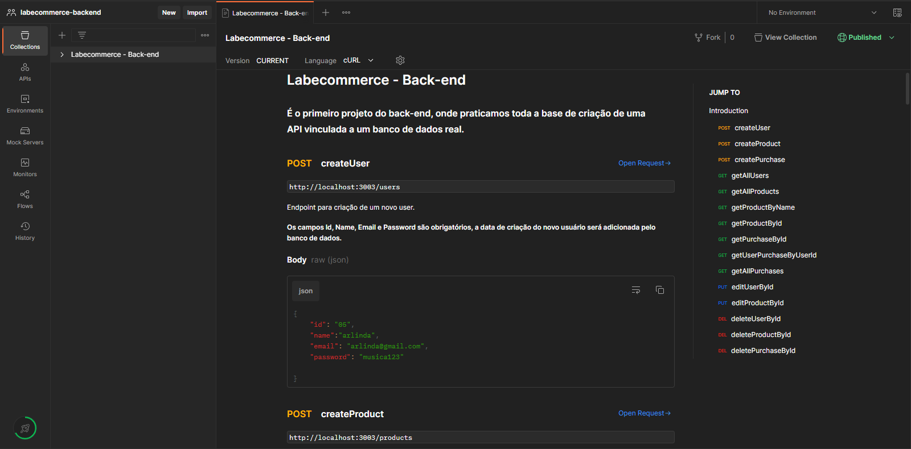

# -Labecommerce - Back-end -

## 📖 Introdução
É o primeiro projeto do back-end, onde praticamos toda a base de criação de uma API vinculada a um banco de dados real. 

<br>
<br>
<br>

## 🔗 Link da aplicação
- Labecommerce API - [aqui.](https://documenter.getpostman.com/view/25826560/2s93Xx1jaf)

<br>
<br>

## 👨‍💻 Desenvolvido Por:
| [<br><sub>Henrique Batista</sub>](https://github.com/HenriqBatista)|
|:---:|

<br>
<br>
<br>

## 📝 Passos para executar o Projeto em sua máquina:

```bash
# Instalando as dependências
npm install

# Executando o projeto
npm run dev

## Obs: é necessário baixar o Postman em sua máquina para ter uma melhor visualização do funcuionamento da API.
```
<br>
<br>

## 💻 Preview do Projeto
<br><sub>Visualização da API no Postman.<sub><br>

<br>
<br>

## 💻 Funcionalidades

Seguindo o flux CRUD, a API possui 15 Endpoints, sendo:
### Create:
- createUser
- createProduct
- createPurchase

### Get:
- getAllUsers
- getAllProducts
- getProductByName
- getProductById
- getPurchaseById
- getUserPurchaseByUserId
- getAllPurchases

### Edit
- editUserById
- editProductById

### Delete
- deleteUserById
- deleteProductById
- deletePurchaseById

<br>
<br>
<br>

## 📚 Bibliotecas Utilizadas

````bash
node.js
typescript
express.js
sqlite
knex
````
<br>
<br>
<br>

## 💡Programas utilizados:
- VSCode
- Postman

<br>
<br>
<br>

# 📫 Contatos

📧 E-mail: henriq.batista.veloso@gmail.com

[](https://www.linkedin.com/in/henrique-batista-veloso/)

